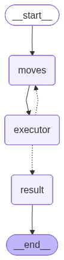
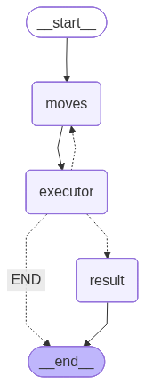

# SokobanAssist: AI-Powered Sokoban Game Assistant
Advanced AI-powered crop disease detection Agentic integrating computer vision models with semantic caching for efficient, scalable plant health diagnostics in precision agriculture.

## 📋 Table of Contents

## 🎯 Overview:
This project implements a Intelligent crop disease detection agentic platform leveraging computer vision and semantic caching to deliver fast, accurate diagnostics while minimizing API calls and infrastructure expenses.
Key Highlights

Natural Language Interaction: An agent the Sokoban Game assistant naturally - no rigid forms or Puzzle Move
Intelligent Response: The Sokoban Game assistant respond and perform relevant Puzzle Move based on context

## 🏗️ Architecture



## Puzzle Move Description of Flowchart:
- **Agent**: → invokes Reflection Invoker
- **Reflection**: Invoker → dynamically selects and calls Processing Logic
- **Processing Response**: → returns results a clear Puzzle Move and natural way for further steps to solve Puzzle game.

## ✨ Features

- **💬 Natural Dialogue**: Ask questions in your own words
- **📊 Detailed Results**: Puzzle Move steps feedback for Agent AI to reflect on the best Puzzle Move
- **🎨 User-Friendly**: Clear, formatted output in the terminal and Gradio UI

## Communication Flow

- **User**: → Upload the Puzzle Sokoban game and the Sokoban Agent query about a Puzzle Move solutions
- **Client**: → Extracts right and wrong move with reflect response and sends to an agent
- **Client** → Formats and displays results to user Sokoban Game Agent in console and UI gradio

## 🔧 Prerequisites
Before you begin, ensure you have the following installed:
- **Python**: 3.13+
- **pip**: (Python package manager)
- **Virtual environment**: (recommended)

**⚠️ Important Note**: If you enable tracing by setting `LANGCHAIN_TRACING_V2=true`, you must have a valid LangSmith API key set in `LANGCHAIN_API_KEY`. Without a valid API key, the application will throw an error. If you don't need tracing, simply remove or comment out these environment variables.

| Variable (.env)| Description | Required |
|----------|-------------|----------|
| `OPENAI_API_KEY` | Your OpenAI API key for LLM access | ⚪ |
| `GEMINI_API_KEY` | Your Gemini API key for LLM access | ⚪ |
| `OLLAMA_PUBLIC_KEY` | Your OLLAMA API key for LLM local access ex: ollama | ✅ |
| `OLLAMA_BASE_URL` | Base URL for OLLMA ex: http://127.0.0.1:11434/v1  | ✅ |
| `GEMINI_BASE_URL` | Base URL for Gemini ex: https://generativelanguage.googleapis.com/v1beta/openai/| ⚪ |
| `ANTHROPIC_BASE_URL` | Base URL for ANTHROPIC ex: https://api.anthropic.com/v1/| ⚪ |
| `LANGCHAIN_API_KEY` | LangSmith API key (required if tracing enabled) | ⚪ |
| `LANGCHAIN_PROJECT` | LangSmith project name (optional) | ⚪ |

## 🛠️ Tech Stack

| Component | Technology | Description |
|-----------|------------|-------------|
| 🖥️ **Frontend** | Gradio | Web application framework |
| 🧠 **AI Framework** | LangChain 🦜🔗 | Orchestrates the AI pipeline |
| 🔍 **OpenAI** | OpenAI Agent framework | Professional profile scraping |
| 🌐 **Ollama** | Local LLM Server | Enhanced use of LLM local |
| 🤖 **LLM** | Ollama3, Ollama3.2, Qwen3, Quen2.5 coder | Powers the conversation generation |
| 📊 **Monitoring** | LangSmith | Optional tracing and debugging |
| 🐍 **Backend** | Python 3.8+ | Core application logic |

## 🚀 How to Run

1. Clone the repository:
   ```bash
   - **STEPS**
      1. git clone https://github.com/padeirocarlos/sokoban-tree-based.git
         curl -fsSL https://ollama.com/install.sh | sh
         ollama server
         ollama pull ollama3  # pull one of this model: gemma4B_v gemma12B_v qwen3 gemini ollama3.2 deepseek
      2. cd sokoban-tree-based
         2.1. touch .env ( create this file put your keys)
         2.2. change variable name in this files:
            - graph/graph.py change LLM type [View implementation](./graph/graph.py#L85-L89)
            - agent/agent.py change agent initial MAX_ITERATIONS in [View implementation](./graph/states.py#L229-L243)
         2.3. Test sokoban some test files: sokoban-tree-based/dataset/test/1_4.txt
      3. uv add -r requirements.txt
         uv run sokoban.py

   - **How to use**:
   Step 1: open the gradio URL in firefox or other browse, the gradio URL like this example: https://277d00fc4eb724a0ce.gradio.live
   Step 2: upload the sokoban game file 
   Step 3: click the "Sokoban Game File Saving...!" botton to upload the file in step 2
   Step 4: click the "Submit" botton to run the agentic flow
   Step 5: check the result in console or gradio UI
   Step 6: After finish reset or start again from step 1

   - **Running on**:
      1. local URL:  
         http://127.0.0.1:7860
  
      2. Running on public URL: 
         output example: https://277d00fc4eb724a0ce.gradio.live



## 📄 License

This project is licensed under the MIT License - see the [LICENSE](LICENSE) file for details.

## 🌟 Support

If you find this project helpful, please consider:

* ⭐ Starring the repository
* 🐛 Reporting issues
* 💡 Contributing improvements
* 📢 Sharing with others

### 📢 Some console logs output example
1. Left → Down → Down → Left → Up → Up | Move result: Cannot move, because the player's new position (1, 7) is a wall, try a different move
2. Left → Down → Down → Right | Move result: Cannot move, because the player's new position (2, 8) is a wall, try a different move
3. Left → Down → Down → Right | Move result: Cannot move, because the player's new position (1, 7) is a wall, try a different move
4. Left → Down → Down → Right | Move result: It is VALID_MOVE, the player's new position is (3, 7) 

### 🔗 Connect with Me

[](https://www.linkedin.com/in/carlos-padeiro-24196b176)
[](https://x.com/cvpadeiro?s=11)

**Built with ❤️ by Carlos Padeiro**

